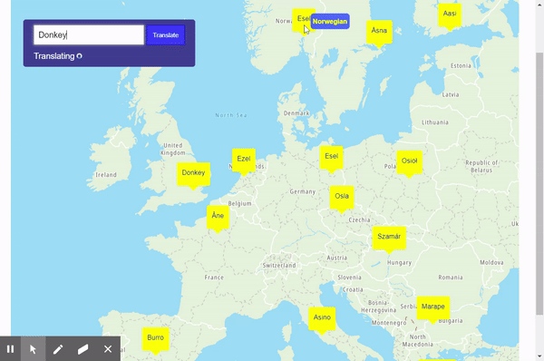

# European Translation Map

This web application provides travelers and language enthusiasts alike a tool that translates words from english into several European languages and displays the translations according to their geographic location.

[Try it yourself!](https://progharrison234.github.io/european-translation-map/)

## Technologies used

The applications operates by integrating two API's

[TomTom Maps API](https://developer.tomtom.com/products/maps-api?gclid=CjwKCAjwqdn1BRBREiwAEbZcR9Wf4yvv-zYNdPuiuSJCpF2l_c_z29CUdHUVXw03WLPxt1B4e273GRoCWngQAvD_BwE)

[MicrosoftAzure Text Translator](https://rapidapi.com/microsoft-azure-org-microsoft-cognitive-services/api/microsoft-translator-text/)

## Contributions 

Thanks to TomTom and Systran above for their free APIs.

Thanks to [Zurb Foundation](https://get.foundation/) for their free CSS Framework.

Thanks to [Font Awesome](https://fontawesome.com/) for their free icons and CSS support.
